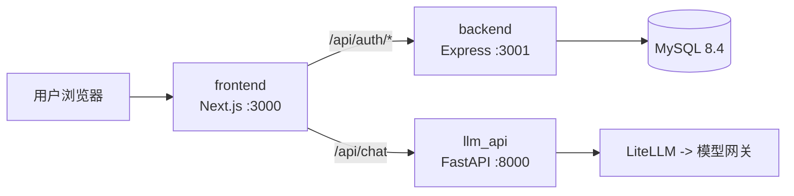
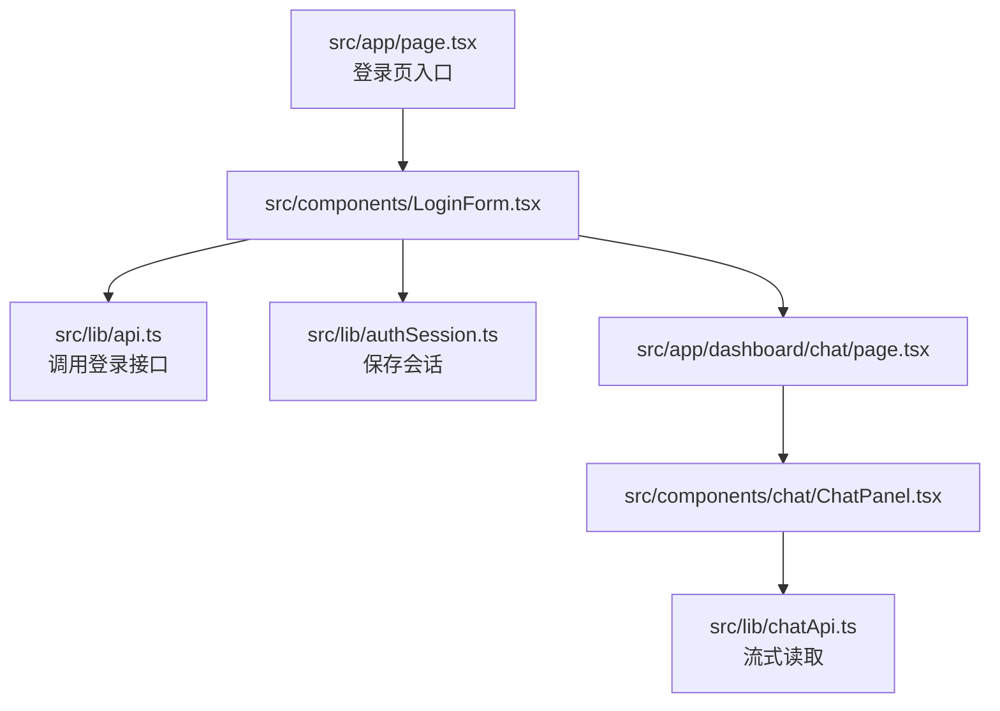
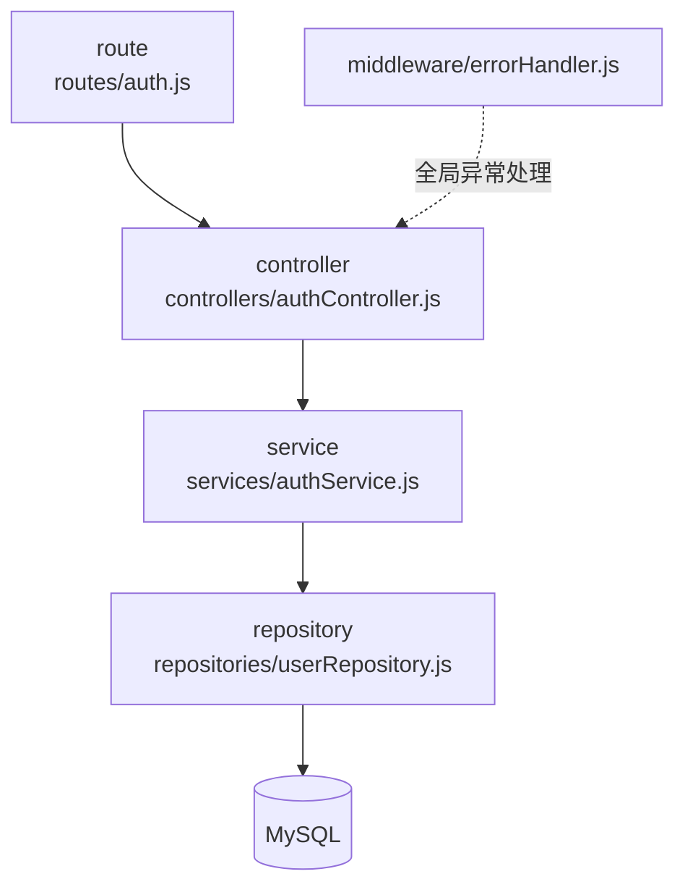
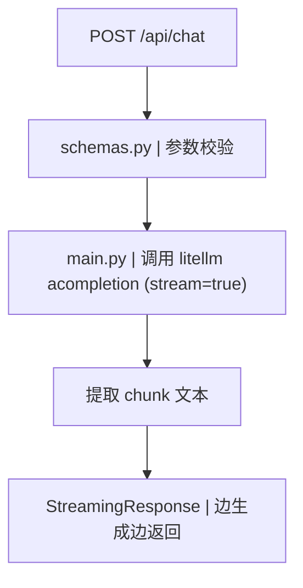
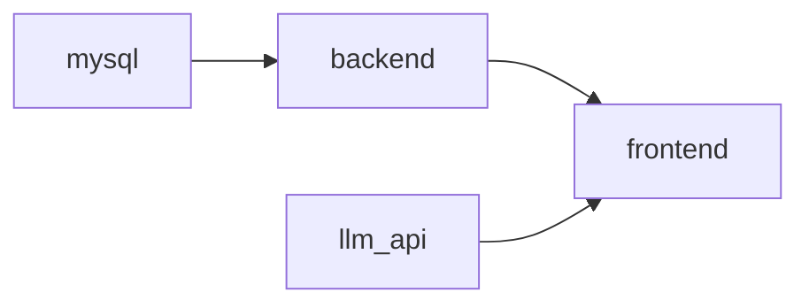
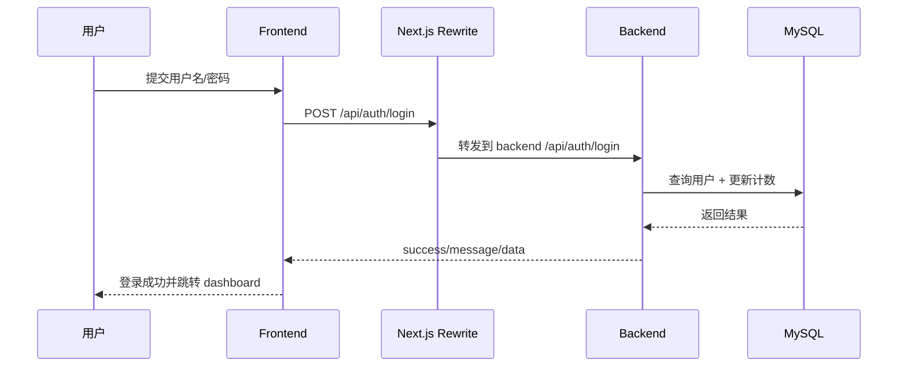
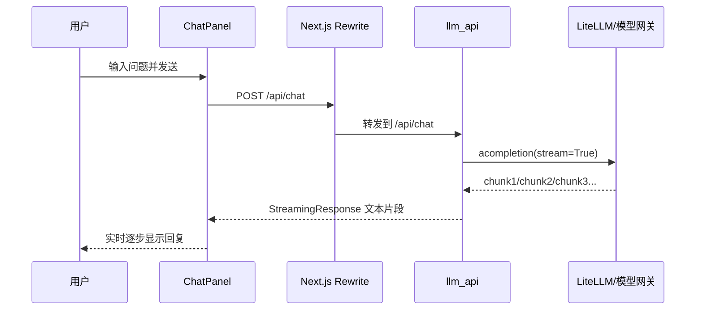

# Login System 项目结构学习手册（新手友好版）

> 文档目标：帮助你看懂这个学习项目的整体架构、关键配置、每个文件的作用。  
> 适用读者：刚接触全栈项目的同学。

## 目录

- [1. 先用一句话理解项目](#1-先用一句话理解项目)
- [2. 用图看懂整体架构](#2-用图看懂整体架构)
- [2.1 图中箭头 -> 文件相对路径对照](#21-图中箭头---文件相对路径对照)
- [3. 专业词翻译（白话版）](#3-专业词翻译白话版)
- [4. 技术栈清单](#4-技术栈清单)
- [5. 项目目录结构总览](#5-项目目录结构总览)
- [6. 文件级说明（每个文件做什么）](#6-文件级说明每个文件做什么)
- [7. 核心配置文件解析](#7-核心配置文件解析)
- [8. 两条关键执行流程](#8-两条关键执行流程)
- [9. 用户视角主线阅读法（最推荐）](#9-用户视角主线阅读法最推荐)
- [10. 新手建议学习顺序](#10-新手建议学习顺序)

## 1. 先用一句话理解项目

这是一个“**登录系统 + 大模型聊天**”的学习项目：
- 前端页面在 `frontend`（Next.js）
- 登录接口在 `backend`（Node.js + Express + MySQL）
- 大模型流式输出接口在 `llm_api`（FastAPI + LiteLLM）
- 一键启动配置在 `docker`

## 2. 用图看懂整体架构

### 图 1：全局架构图（最重要）



### 2.1 图中箭头 -> 文件相对路径对照

| 图中箭头 | 代码定位（相对路径） |
| --- | --- |
| `/api/auth/* -> backend:3001` | `frontend/next.config.js`（`/api/:path*` 代理到 `:3001`）<br>`backend/src/app.js`（`app.use('/api/auth', authRoutes)`）<br>`backend/src/routes/auth.js`（`POST /register`、`POST /login`） |
| `/api/chat -> llm_api:8000` | `frontend/src/lib/chatApi.ts`（`fetch('/api/chat')`）<br>`frontend/next.config.js`（`/api/chat` 代理到 `llm_api`）<br>`llm_api/app/main.py`（`@app.post('/api/chat')`）<br>`frontend/.env.local`（`LLM_API_PROXY_TARGET`）<br>`docker/docker-compose.yml`（`llm_api` 服务端口映射） |
| `backend -> MySQL 8.4` | `backend/src/config/db.js`（创建 MySQL 连接池）<br>`backend/src/repositories/userRepository.js`（执行查询/更新）<br>`backend/sql/init.sql`（建库建表）<br>`backend/.env`（`DB_HOST/DB_PORT/DB_USER/DB_PASSWORD/DB_NAME`）<br>`docker/docker-compose.yml`（`mysql` 服务定义 + `backend` 环境注入） |
| `llm_api -> LiteLLM -> 模型网关` | `llm_api/app/main.py`（`litellm.acompletion(...)`）<br>`llm_api/app/settings.py`（读取 `MODEL_NAME`/`LITELLM_PROVIDER`/`LITELLM_API_BASE`）<br>`llm_api/.env`（网关地址和 key）<br>`llm_api/pyproject.toml`（`litellm` 依赖）<br>`docker/docker-compose.yml`（`MODEL_NAME`、`OPENAI_API_KEY` 等环境变量注入） |

### 2.2 前端连接后端是怎么连上的（完整路径）

#### A. 登录接口（前端 -> Node 后端 -> MySQL）

`frontend/src/components/LoginForm.tsx`  
-> `frontend/src/lib/api.ts`（`fetch('/api/auth/login')`）  
-> `frontend/next.config.js`（`/api/:path*` rewrite 到 `backend:3001`）  
-> `backend/src/app.js`（`app.use('/api/auth', authRoutes)`）  
-> `backend/src/routes/auth.js`（`POST /login`）  
-> `backend/src/controllers/authController.js`  
-> `backend/src/services/authService.js`  
-> `backend/src/repositories/userRepository.js`  
-> `backend/src/config/db.js`（MySQL 连接池）  
-> `backend/sql/init.sql` 对应的数据表（`users` / `login_audit`）

#### B. 聊天接口（前端 -> FastAPI 后端 -> LiteLLM）

`frontend/src/components/chat/ChatPanel.tsx`  
-> `frontend/src/lib/chatApi.ts`（`fetch('/api/chat')`）  
-> `frontend/next.config.js`（`/api/chat` rewrite 到 `llm_api:8000`）  
-> `llm_api/app/main.py`（`@app.post('/api/chat')`）  
-> `llm_api/app/settings.py`（读取模型网关配置）  
-> `litellm.acompletion(...)`（在 `llm_api/app/main.py` 中调用）  
-> 上游模型网关（`LITELLM_API_BASE`，配置在 `llm_api/.env`）

### 图 2：前端内部结构图



### 图 3：后端（登录服务）分层图



### 图 4：LLM 服务处理图



### 图 5：Docker 启动依赖图



## 3. 专业词翻译（白话版）

- `Monorepo`：一个仓库里放多个子项目（前端、后端、LLM）。
- `BFF`：前端的“中间层”，帮浏览器统一转发 API。
- `Rewrite`：URL 重写，把一个路径转发到另一个服务。
- `Middleware`：请求到达业务代码前/后执行的公共逻辑（如跨域、异常处理）。
- `Repository`：专门写数据库操作的层。
- `StreamingResponse`：服务端一点点返回内容，不用等全部生成完。
- `ORM`：对象关系映射；本项目没用 ORM，而是直接写 SQL。
- `CORS`：跨域设置，允许不同域名/端口访问接口。

## 4. 技术栈清单

- 前端框架：`Next.js 14` + `React 18` + `TypeScript`
- 登录后端：`Node.js` + `Express`
- LLM 服务：`FastAPI` + `Uvicorn` + `LiteLLM`
- 数据库：`MySQL 8.4`
- 通信方式：REST API + 流式文本输出
- 容器编排：`Docker Compose`

## 5. 项目目录结构总览

```text
login_system/
├─ frontend/          # 前端（页面、组件、前端 API 封装）
├─ backend/           # 登录后端（路由、业务、数据库访问）
├─ llm_api/           # 大模型后端（流式聊天）
├─ docker/            # docker compose 与环境变量
└─ docs/              # 项目说明文档
```

## 6. 文件级说明（每个文件做什么）

### 6.1 `frontend` 目录

- `frontend/package.json`：前端依赖和脚本（`dev/build/start`）。
- `frontend/next.config.js`：Next 的核心配置，重点是 API 代理规则（rewrites）。
- `frontend/tsconfig.json`：TypeScript 编译规则。
- `frontend/.env.local`：前端本地环境变量。
- `frontend/.env.local.example`：前端环境变量模板。
- `frontend/Dockerfile`：前端镜像构建脚本（多阶段构建）。
- `frontend/src/app/layout.tsx`：全局 HTML 壳布局。
- `frontend/src/app/page.tsx`：登录页路由 `/`。
- `frontend/src/app/dashboard/layout.tsx`：Dashboard 公共布局（侧边栏 + 内容区）。
- `frontend/src/app/dashboard/page.tsx`：Dashboard 根页，重定向到聊天页。
- `frontend/src/app/dashboard/chat/page.tsx`：聊天页面路由。
- `frontend/src/app/globals.css`：全局样式。
- `frontend/src/components/LoginForm.tsx`：登录表单与登录逻辑。
- `frontend/src/components/layout/Sidebar.tsx`：Dashboard 左侧菜单。
- `frontend/src/components/chat/ChatPanel.tsx`：聊天输入、消息列表、流式展示。
- `frontend/src/lib/api.ts`：登录接口请求封装。
- `frontend/src/lib/chatApi.ts`：聊天流式接口请求封装。
- `frontend/src/lib/authSession.ts`：会话读写（`sessionStorage`）。
- `frontend/src/types/chat.ts`：聊天消息类型定义。

### 6.2 `backend` 目录

- `backend/package.json`：后端依赖与脚本（`dev/start/test`）。
- `backend/.env`：后端本地配置（端口、数据库连接）。
- `backend/.env.example`：后端配置模板。
- `backend/Dockerfile`：后端镜像构建脚本。
- `backend/sql/init.sql`：数据库初始化脚本（建库、建表、索引、初始化数据）。
- `backend/src/server.js`：后端启动入口（加载环境变量、测试 DB、监听端口）。
- `backend/src/app.js`：Express 应用装配（中间件、路由、错误处理）。
- `backend/src/routes/auth.js`：注册/登录路由定义。
- `backend/src/controllers/authController.js`：接收请求并调用 service。
- `backend/src/services/authService.js`：登录注册核心业务逻辑。
- `backend/src/repositories/userRepository.js`：数据库增删改查。
- `backend/src/config/db.js`：MySQL 连接池配置。
- `backend/src/middleware/errorHandler.js`：404 和全局异常处理。
- `backend/src/utils/response.js`：统一成功/失败响应结构。
- `backend/src/utils/AppError.js`：业务异常类。
- `backend/tests/auth.service.test.js`：后端业务测试样例。

### 6.3 `llm_api` 目录

- `llm_api/pyproject.toml`：Python 项目依赖与测试配置。
- `llm_api/uv.lock`：Python 依赖锁定文件。
- `llm_api/.env`：LLM 服务环境变量。
- `llm_api/.env.example`：LLM 环境变量模板。
- `llm_api/Dockerfile`：LLM 服务镜像构建脚本。
- `llm_api/app/main.py`：FastAPI 应用入口与 `/api/chat` 核心逻辑。
- `llm_api/app/settings.py`：读取环境变量配置。
- `llm_api/app/schemas.py`：请求体数据模型定义。
- `llm_api/tests/test_chat_stream.py`：LLM 流式接口测试样例。

### 6.4 `docker` 目录

- `docker/docker-compose.yml`：本地开发用 compose（带 build）。
- `docker/docker-compose.prod.yml`：生产部署用 compose（拉镜像）。
- `docker/.env.docker`：本地 docker 环境变量。
- `docker/.env.docker.example`：本地 docker 变量模板。
- `docker/.env.prod`：生产环境变量。
- `docker/.env.prod.example`：生产变量模板。

### 6.5 `docs` 目录

- `docs/README.md`：项目主文档（启动、部署、排障）。
- `docs/LiteLLM接入与代码解读.md`：LLM 接入与调用链说明。
- `docs/大模型流式输出问题与解决.md`：流式输出问题排查文档。
- `docs/生成项目教程.md`：学习/审核向教程。
- `docs/plans/*`：历史实施计划记录。

## 7. 核心配置文件解析

### 7.1 `frontend/next.config.js`

你最需要理解的是这两条代理规则：
- `/api/chat` -> `llm_api`
- 其他 `/api/*` -> `backend`

白话理解：浏览器只认一个入口（前端 3000），Next.js 在内部把请求转发到不同后端服务。

### 7.2 `backend/.env`

- `PORT`：后端端口（默认 3001）
- `DB_HOST/DB_PORT`：数据库地址
- `DB_NAME`：数据库名
- `DB_USER/DB_PASSWORD`：数据库账号密码
- `DB_TIMEZONE`：时区

### 7.3 `llm_api/.env`

- `MODEL_NAME`：要调用的模型名
- `LITELLM_PROVIDER`：模型提供方标识
- `LITELLM_API_BASE`：模型网关地址
- `OPENAI_API_KEY`：访问模型网关的 key
- `CORS_ALLOW_ORIGINS`：允许跨域的前端地址

### 7.4 `docker/docker-compose.yml`

作用：一次性拉起四个容器服务：
- `mysql`
- `backend`
- `llm_api`
- `frontend`

## 8. 两条关键执行流程

### 8.1 登录流程（图）



### 8.2 聊天流式流程（图）



## 9. 用户视角主线阅读法（最推荐）

你这个方法非常适合新手：**先死盯一个动作，不要同时看太多分支。**

### 9.1 你的理解里，哪些是对的，哪些要修正

下面按你的原话来对齐：

1. 你说 `handleSubmit` 后不知道怎么跳转  
这个点你找得很准。真正触发跳转的是 `frontend/src/components/LoginForm.tsx` 里的：
- `const result = await login(...)`
- 成功后 `router.push('/dashboard/chat')`

2. 你问是不是 `response.json()` 在“导向接口”  
需要修正：`response.json()` 只是把后端返回的 JSON 解析成 JS 对象，不负责路由跳转或转发。  
“导向哪里”由 `frontend/next.config.js` 的 `rewrites` 决定。

3. 你把 `/api/chat`、`/api/:path*` 理解为“拦截器”  
接近但不完全准确。更准确叫法是“重写/代理规则（rewrite/proxy）”。  
作用：把前端请求路径改写并转发到不同后端服务。

4. 你说 `app.use('/api/auth', authRoutes)` 是和前面对应的转发  
这个理解是对的。前端被 rewrite 到 backend 后，Express 在这里把 `/api/auth/*` 交给 `authRoutes` 处理。

5. 你说 `app.get('/')` 这一段是“拦截注册/登录”  
这里要修正：`app.get('/')` 只处理根路径 `/`，返回一个说明 JSON。  
注册/登录不是它处理的，而是：
- `/api/auth/register`
- `/api/auth/login`

6. 你看到 `router.post('/login', authController.login)`  
这个理解是对的：这是路由到控制器的映射。

7. 你问 `require('../repositories/userRepository')` 是什么  
是的，本质是“按相对路径导入模块”。  
- `..` 表示上一级目录
- `../repositories/userRepository` 指向该文件并拿到它 `module.exports` 导出的内容

8. 你问为什么叫 `pool`  
`pool` 是 connection pool（连接池）的通用命名。  
意思：不是每次查询都新建连接，而是复用一组可复用连接，性能更稳定。

9. 你访问 `http://localhost:3306/` 为什么打不开  
这是正常的。3306 是 MySQL 协议端口，不是 HTTP 网页端口。  
浏览器访问的是 HTTP/HTTPS；MySQL 要用数据库客户端连接（如 `mysql` 命令行、Navicat、DBeaver）。

10. 你问 `mysql2/promise` 是什么  
`mysql2` 是 Node 连接 MySQL 的库。`/promise` 表示使用 Promise 版本 API，能配合 `async/await` 写法。

11. 你说“JS 好像只有实现没有定义”  
这里是语言风格差异：  
- 在 C# 常见“接口/类定义 + 实现”更显式  
- 在当前 Node 项目里常用“函数 + 模块导出”的方式组织  
并不是没有定义，而是“定义和实现通常在同一文件内”。

这里建议你先盯“用户发一条消息，系统怎么返回结果”这条主线：

1. 用户在聊天框点击发送  
看 `frontend/src/components/chat/ChatPanel.tsx`：提交时调用了哪个函数。

2. 前端怎么发请求  
看 `frontend/src/lib/chatApi.ts`：`fetch('/api/chat')` 是怎么带参数的。

3. 请求为什么会到 `llm_api`  
看 `frontend/next.config.js`：`/api/chat` 被 rewrite 到 `llm_api:8000/api/chat`。

4. 后端怎么接收参数  
看 `llm_api/app/main.py` + `llm_api/app/schemas.py`：`@app.post('/api/chat')` 和请求体结构。

5. 怎么调用 LiteLLM 跑流式  
看 `llm_api/app/main.py`：`litellm.acompletion(stream=True)`。

6. 怎么把结果返回给前端  
看 `llm_api/app/main.py`：`StreamingResponse(...)` 持续 `yield` 文本；  
再回到 `frontend/src/lib/chatApi.ts` 看 `reader.read()` 如何逐段显示。

一句话总结这条主线：

`ChatPanel.tsx`  
-> `chatApi.ts`  
-> `next.config.js`  
-> `llm_api/main.py`  
-> `litellm.acompletion(stream=True)`  
-> `StreamingResponse`  
-> 前端 `reader.read()` 实时渲染

你把这条线摸透后，再去看登录链路（`/api/auth/login`）会非常轻松。

### 9.2 按你的例子，登录链路正确版（一步一步）

1. 用户提交登录表单  
`frontend/src/components/LoginForm.tsx` 的 `handleSubmit` 被触发。

2. 前端调用登录 API  
`frontend/src/lib/api.ts` 里执行：
- `fetch('/api/auth/login', { method: 'POST', body: ... })`
- `response.json()` 只是解析返回结果。

3. Next.js 转发到后端  
`frontend/next.config.js` 里：
- `/api/:path*` -> `http://localhost:3001/api/:path*`  
所以 `/api/auth/login` 会被转发到 backend。

4. Express 进入路由系统  
`backend/src/app.js`：
- `app.use('/api/auth', authRoutes)` 把 `/api/auth/*` 交给 `authRoutes`。

5. 路由映射到控制器  
`backend/src/routes/auth.js`：
- `POST /login` -> `authController.login`

6. 控制器调用服务层  
`backend/src/controllers/authController.js`：
- 收参数（用户名、密码、IP）
- 调用 `authService.login(...)`

7. 服务层处理业务规则  
`backend/src/services/authService.js`：
- 参数校验
- 查用户/比对密码
- 调用 repository 做数据库读写

8. Repository 执行 SQL  
`backend/src/repositories/userRepository.js`：
- 使用 `pool.query(...)` 执行 SQL

9. 数据库连接来自连接池  
`backend/src/config/db.js`：
- `mysql.createPool(...)` 读取 `.env` 中 DB 配置并建立连接池

10. 响应逐层返回到前端并跳转页面  
controller 返回成功 JSON -> 前端 `LoginForm.tsx` 收到成功 ->  
`persistUserSession(...)` 保存会话 -> `router.push('/dashboard/chat')` 跳转。

## 10. 新手建议学习顺序

1. 先看 [docs/README.md](/Users/xiaofeng/Documents/实习任务/login_system/docs/README.md) 跑起来项目。  
2. 再看 [frontend/next.config.js](/Users/xiaofeng/Documents/实习任务/login_system/frontend/next.config.js) 理解“一个前端转发两个后端”。  
3. 看登录链路：`LoginForm -> api.ts -> backend/authController -> authService -> userRepository`。  
4. 看聊天链路：`ChatPanel -> chatApi -> llm_api/main.py -> litellm`。  
5. 最后看 `docker-compose.yml`，把本地分服务运行和容器运行对上号。
